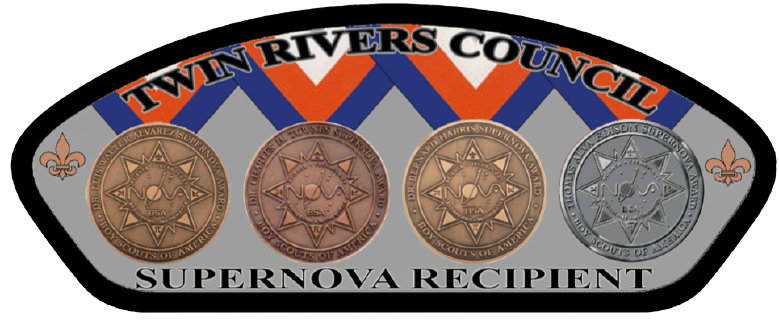

.. _introduction:

Welcome to The **STEM COMMITTEE** of *Twin Rivers Council*
++++++++++++++++++++++++++++++++++++++++++++++++++++++++++

.. admonition:: **Our Mission**

		The mission of the STEM committee is to  promote the STEM/Nova activities to all Youths of the Council by offering a rich array of STEM-related activities offered by technical experts and volunteers. The activities are positioned in large part, but are not limited to, BSA-sponsored activities. The STEM committee strives to offer a safe and inclusive atmosphere to all cub scouts, Scouts BSA, and explorers.
	

.. note:: **Council and District Chairs**

	  * Council: `Vincent Meunier <mailto:twinriversstem@gmail.com>`__
	  * Adirondacks: `Jerry Neff <mailto:jneff8@twcny.rr.com>`__
	  * Fort Orange: `George Hassel <mailto:ghassel@siena.edu>`__
	  * Mohawk: `Barry Pardee <mailto:barry.m.pardee@gmail.com>`__
	  * Turning Point: `Ira Martin <mailto:iramartin@nycap.rr.com>`__
	  * Yankee Doodle: `Jay Bemis <mailto:jrbemis5326@gmail.com>`__

.. note:: **Roles of the STEM Committee Chairs**
   
   * Serve as the representative and spokesperson for the council/chair ’s STEM initiative and the Nova Awards program.
   * Offer personal endorsements and testimony to support the STEM initiative and Nova Awards program.
   * Identify prospective volunteers and key organizations and events that could help support the BSA’s STEM initiatives.
   * Ensure integration of the awards with all training opportunities, such as a “This Is the Nova Award” workshop.
   * Help organize council STEM-based events such as a STEM Merit Badge Day.
   * Integrate Nova awards with existing camp programs (merit badges, belt loops, pins).
   * Prospect, meet, and recruit key STEM leaders in our community.
   * Help educate council staff and volunteers about the Nova Awards program and STEM initiative and about how they can help promote the program and initiative.
   * With the Scout executive at local council events, present youth members with the NOVA awards they have earned.

     
   Shoulder Patch Offered by the Committee for all Supernova Award recipients. More on the Supernova awards can be found `here <https://www.scouting.org/stem-nova-awards/awards/>`__. 

Go to Twin Rivers District `website <https://www.trcscouting.org>`_. 
